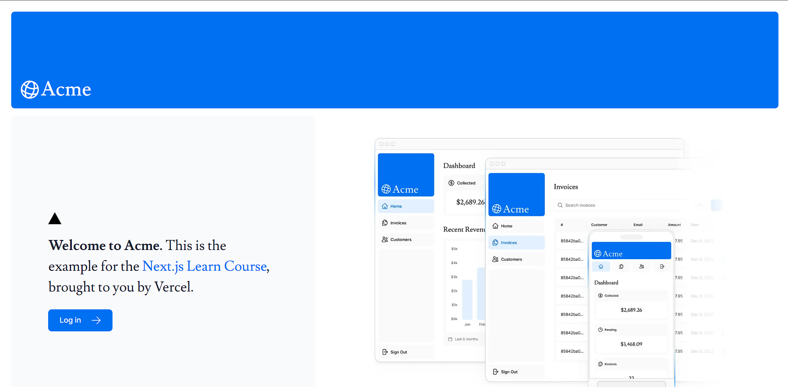

# NextJS Invoice Dashboard

## Description

This is a straightforward Invoice Dashboard web app developed with Next.js. It enables users to manage invoices by viewing, creating, editing, and deleting them. Additionally, it provides a dashboard view for users to gain insights into their invoice data. Demonstration is available on a NEXTJS website.

## Demo
[Dashboard Demo](https://next-js-dashboard-git-main-meanhor-keas-projects.vercel.app/)

## User Interface 

1. **Login Screen:**
  
  
2. **Home Screen:**
  
3. **Invoice Screen:**
  
4. **Create Invoice Screen:**
  
5. **Edit Invoice Screen:**
  

## Getting Started

To get the project running locally, follow these steps:

### Prerequisites

Make sure you have Node.js installed on your machine. You can download it from [nodejs.org](https://nodejs.org/).

### Installation

1. Clone the repository:

   ```bash
   git clone https://github.com/Meanhor/NextJS_Dashboard
   ```

2. Navigate into the project directory:

   ```
   cd NextJS_Dashboard
<<<<<<< HEAD
   ```
3. Install pnpm
   ```
   npm install -g pnpm
   ```
4. Install dependencies
  ```
   pnpm i
   ```

=======
   ```

3. Install pnpm

   ```
   npm install -g pnpm
   ```
4. Install dependencies

  ```
   pnpm i
   ```
5. Cofiguration your .env file 

```bash
   POSTGRES_URL=
   POSTGRES_PRISMA_URL=
   POSTGRES_URL_NON_POOLING=
   POSTGRES_USER=
   POSTGRES_HOST=
   POSTGRES_PASSWORD=
   POSTGRES_DATABASE=

   # `openssl rand -base64 32`
   AUTH_SECRET=
   AUTH_URL=http://localhost:3000/api/auth
   ```

6. Open your browser and navigate to [http://localhost:3000](http://localhost:3000) to view the application.

7. **Login Credentials:**
   Use the following credentials to log in to the application:

- Email: user@nextmail.com
- Password: 123456
>>>>>>> 70cdd89 (Revise Readme)

### Development

To start the development server:

    ```
    pnpm dev
    ```

## Credits

This project was developed by following the official [Next.js tutorial](https://nextjs.org/learn) from Chapters 1 through 16. Below is an overview of the key features I have learned throughout the course:

1. **Styling**: Various methods to style applications in Next.js.
2. **Optimizations**: Techniques to optimize images, links, and fonts for better performance.
3. **Routing**: How to implement nested layouts and pages using Next.js's file-based routing system.
4. **Data Fetching**: Setting up a database on Vercel and following best practices for fetching and streaming data.
5. **Search and Pagination**: Implementing search and pagination functionality using URL Search Parameters.
6. **Mutating Data**: Using React Server Actions to modify data and revalidate the Next.js cache.
7. **Error Handling**: Approaches to manage errors, including 404 pages and general error handling strategies.
8. **Form Validation and Accessibility**: Performing server-side form validation and enhancing accessibility.
9. **Authentication**: Integrating user authentication using NextAuth.js and Middleware.
10. **Metadata**: Adding metadata and optimizing the application for social sharing.


## Reference

For more information, see the [course curriculum](https://nextjs.org/learn) on the Next.js Website.
